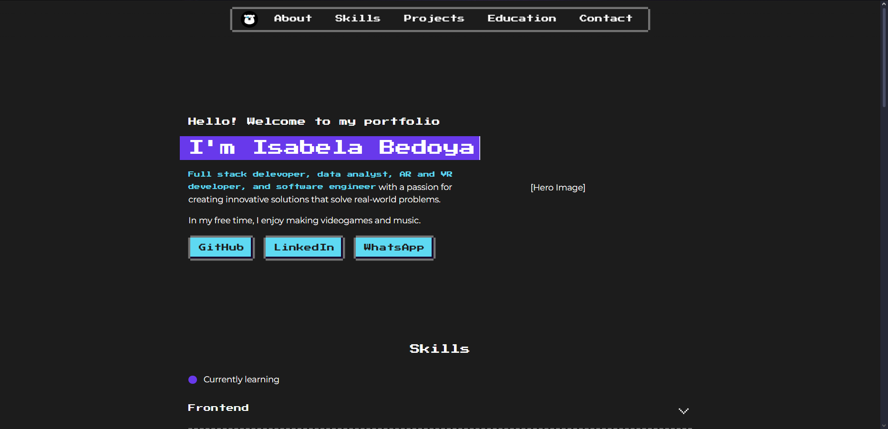

<h1 align="center">
	Portfolio Website - v1.0 
	<a align="center" href="https://isabedoya.netlify.app/" target="_blank">isabedoya.portfolio</a>
</h1>

## Built With

This project was built with the following tools:

* [React](https://reactjs.org/)
* [Vite](https://vitejs.dev/)
* [TypeScript](https://www.typescriptlang.org/)
* [Sass](https://sass-lang.com/)
* [Pixelact UI](https://pixelact.io/)
* [EmailJS](https://emailjs.com/)

## Features

* Responsive design (soon)
* Single Page Application (SPA)
* Styled with Pixelact UI and Sass

## Getting Started

To get a local copy up and running follow these simple example steps.

1. Clone the repo: `git clone https://github.com/CodeInTheIzzyverse/Portfolio`
2. Install dependencies: `npm install`
3. Start the development server: `npm run dev`

## Contributing

Show your support by giving a ⭐️ to this project!

## License

This project is licensed under the MIT License - see the [LICENSE.md](LICENSE.md) file for details.
